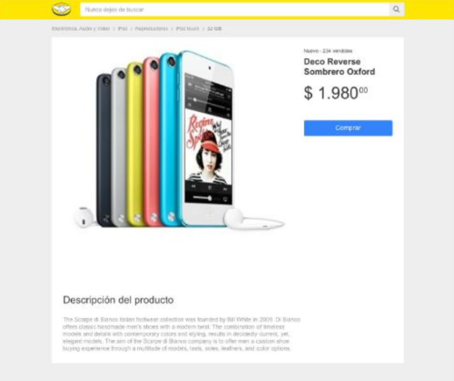
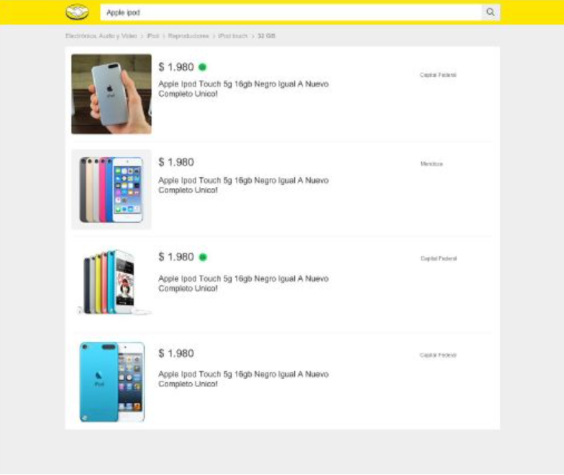

# Documentación Challenge

## Cómo levantar el proyecto

* Recomendable contar con node: '>=18.0.0', npm: '>=8.0.0'
* Clonar el repositorio
* Instalar las dependencias de `api/` y de `client/`
* Levantar los servicios con `npm start` e ingresar a `http://localhost:5173`

```bash
    # Consola 1
    git clone https://github.com/lauty95/meli-challenge.git
    cd meli-challenge
    cd api
    npm i
    npm start
    # Para desarrollo se puede hacer npm run dev
```

```bash
    # Consola 1
    git clone https://github.com/lauty95/meli-challenge.git
    cd meli-challenge
    cd client
    npm i
    npm start
```

---


Este proyecto es un challenge de Frontend y consta de la siguiente estructura

## API

Un servidor de Node JS hecho con Express en `api/`

El servidor cuenta con las siguientes rutas:
- `/items/:id`
    * Formato de la respuesta:
        ```javascript
        {
            author: {
                name: 'Lautaro',
                lastname: 'Juarez'
            },
            item: {
                id: String,
                title: String,
                price: {
                    currency: String,
                    amount: Number,
                    decimals: Number
                },
                picture: String,
                condition: String,
                free_shipping: Boolean,
                sold_quantity: Number,
                description: String
            }
        }
        ```

    * En caso de no tener id devolverá un status 400 con un JSON:
        ```javascript
        { error: true, descripcion: 'Sin item id' }
        ```
- `/items?search=`
    * Formato de la respuesta:
        ```javascript
        {
            author: {
                name: 'Lautaro',
                lastname: 'Juarez'
            },
            categories: [String],
            items: [
                {
                    id: String,
                    title: String,
                    price: {
                        amount: Number,
                        currency: String,
                        decimals: Number
                    },
                    picture: String,
                    condition: String,
                    free_shipping: Boolean
                }
            ]
        }
        ```

    * En caso de no tener id devolverá un status 400 con un JSON:
        ```javascript
        { error: true, descripcion: 'Sin item id' }
        ```
- En caso de error la aplicación devolverá un status 501 y JSON con el detalle

- Como dependencia de desarrollo se usó `nodemon` y se configuró el script `dev` para acomodar el código y al guardar los cambios reiniciar el servidor:

```JSON
"scripts": {
    "start": "node index.js",
    "dev": "nodemon --exec \"npm run lint && node\" index.js",
    "lint": "standard --fix"
}
```

## Cliente

Un cliente realizado con <b>HTML React JS y Sass</b> en `client/`

- El proyecto se levantó con vite y se usó el plugin `@vitejs/plugin-react`. Estas configuraciones están en `client/vite.config.js`
- Como dependencia para los estados globales se usó <b>Redux Toolkit</b>
    * Su configuración se puede encontrar en `client/src/store/`
    * Como estado inicial se configuró:
        ```javascript
            {
                list: [],
                categories: []
            }
        ```

        Esta herramienta nos ayuda a mantener el estado de las búsquedas (guardada en list) y su categoría (guardada en categories) y así, al navegar al detalle de un item y volver a la página anterior no se vuelve a realizar el llamado a la api

        ----
- La estructura del proyecto cuenta con *views* armado a partir de *components* para armar las vistas solicitadas:

 * `src/views/ItemDetails.jsx` Vista del detalle del producto




  * `src/views/ItemsResult.jsx` Vista del resultado de la búsqueda
  


  * `src/views/Navbar.jsx` Vista de la caja de búsqueda

 

- Luego, en `src/components/` se desarrolló cada componente para armar las vistas:
    * Breadcrumb.jsx > Para mostrar la categoría
    * ItemList.jsx > Para mostrar cada producto en los resultados de la búsqueda
    * Line.jsx > Para la línea divisora entre productos

- Además en `src/styles/` se siguió la misma estructura que se usó con las vistas y componentes

- En `src/hooks` se creó un custom hook para obtener el query param para hacer el llamado, este hook se creó para no repetir código en `ItemsResult.jsx` y en `Navbar.jsx`. En el primer caso se usó para tomar de la URL lo que se desea buscar y en Navbar para setear el estado local de lo que se escriba en la caja de búsqueda (pensando en que si se recarga la página también lo pueda tomar)


## Configuraciones generales

Tanto en `api` como en `client` se realizaron las siguientes configuraciones similares

### Axios
Para axios encontraremos la configuración en `../configs/axiosConfig.js`.

### ESLint
Para ESLint se usó Standard como dependencia de desarrollo y se puede encontrar en el `/package.json` de api y client

```JSON
"eslintConfig": {
    "extends": "./node_modules/standard/eslintrc.json"
}
```

### Helpers
Para algunos casos en los que se requiere funciones que puedan repetirse se creó una carpeta helpers

